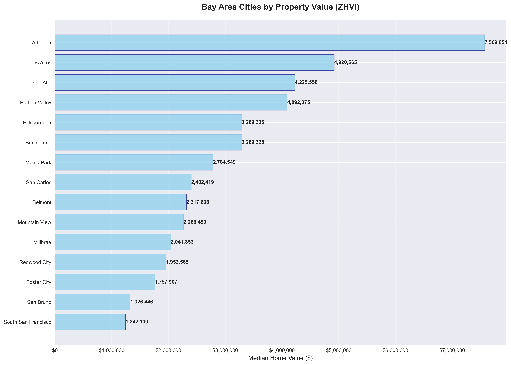
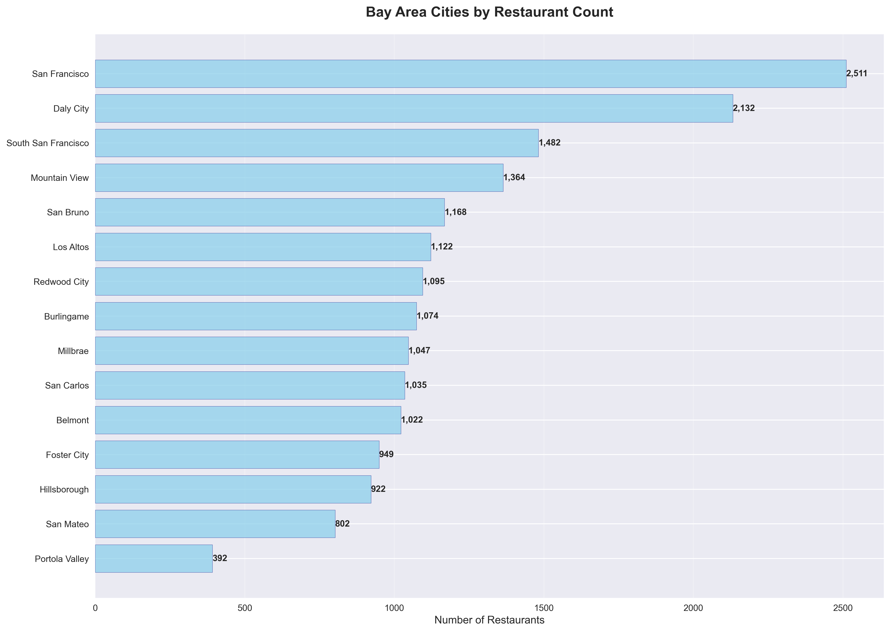
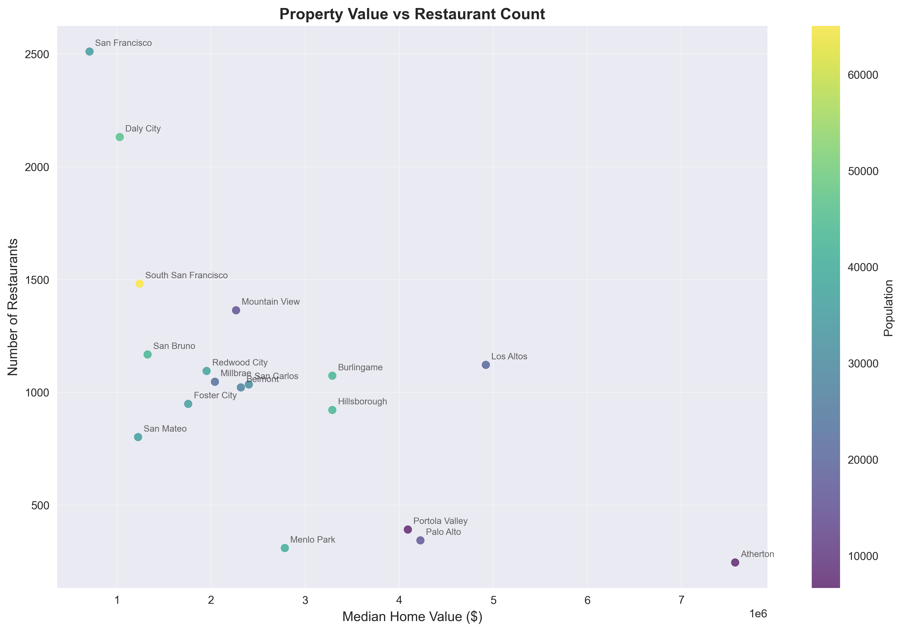

# Project Report: Forks & Fortunes

## Introduction: Does a Fatter Wallet Mean a Better Dinner?

This report tackles a question that has plagued philosophers, economists, and anyone who's ever been hungry in a new neighborhood: does more money mean better food? Specifically, we set out to explore the relationship between the affluence of various Bay Area cities and the state of their restaurant scenes. Our guiding principle was to see if a clear line could be drawn between the price of a mortgage and the quality of a meal. What we found was a story more complex and far more interesting than we'd anticipated.

## Our Not-So-Secret Sauce: A Deep Dive into the Methodology

To get to the bottom of this, we developed a multi-stage analysis pipeline that combines data from several authoritative sources. Here's a step-by-step look at how we did it:

### Stage 1: Data Collection - The Foundation of Our Analysis

We started by gathering data from three key sources:

*   **U.S. Census Bureau**: We used the Census API to pull the latest American Community Survey (ACS) 5-Year data for a comprehensive list of Bay Area ZIP codes. We focused on the following key variables:
    *   `B25077_001E`: Median Home Value
    *   `B25001_001E`: Total Housing Units
    *   `B19013_001E`: Median Household Income
    *   `B01003_001E`: Total Population
*   **Zillow**: We supplemented the Census data with Zillow's Home Value Index (ZHVI) data. This provided us with a more up-to-date and market-driven measure of property values. Our system is designed to intelligently parse the Zillow data to find the most recent month's figures.
*   **Google Places API**: This was the cornerstone of our restaurant data collection. We used the API to gather detailed information on restaurants, including their location, star rating, price level, and the total number of user ratings.

### Stage 2: Data Processing and Enrichment - Where the Magic Happens

Once we had the raw data, we had to process and enrich it to make it useful for analysis:

*   **Grid-Based Search**: To ensure we didn't miss any hidden gems, we implemented a grid-based search algorithm. For each city, we first determined its geographical center. Then, we blanketed the area with a grid of overlapping search circles, making thousands of calls to the Google Places API to ensure comprehensive coverage.
*   **The Quality Quotient**: A simple star rating can be misleading. So, we developed our own composite "quality score." This algorithm takes the base rating and adjusts it based on the number of reviews (a 5-star rating from 1,000 people is more credible than one from the owner's mom) and the price level, giving us a more nuanced measure of a restaurant's true quality. The formula, in essence, is:

    `Quality Score = (Base Rating * Credibility Factor) * Price Adjustment`

    Where the "Credibility Factor" increases with the number of reviews, and the "Price Adjustment" gives a slight boost to mid-range restaurants.
*   **Data Deduplication**: To ensure accuracy, we carefully deduplicated the restaurant data based on their unique Google Places ID. This ensured that each establishment was only counted once, even if it was picked up in multiple grid searches.
*   **Merging Datasets**: We then merged the cleaned and enriched restaurant data with the Census and Zillow data, using ZIP codes as the common key. This gave us a single, comprehensive dataset that allowed us to perform our analysis.

### Stage 3: Analysis and Visualization - Telling the Story

With our master dataset in hand, we performed a series of analyses and created visualizations to explore the relationships between the different variables:

*   **Ranking and Comparison**: We ranked the cities based on a variety of metrics, including property value, restaurant count, quality score, and restaurant density.
*   **Correlation Analysis**: We calculated the correlation between property values and restaurant counts to statistically measure the strength of their relationship.
*   **Visualization**: We generated a series of charts and maps to visually represent our findings, including bar charts for rankings, a scatter plot to show the relationship between wealth and restaurant density, and interactive maps for each city.

## Visualizing the Data: A Picture is Worth a Thousand Numbers

Sometimes, the best way to understand the data is to see it. We generated a series of visualizations to help illustrate our findings.

### Property Value and Restaurant Count Rankings

*This chart clearly shows Atherton in a league of its own when it comes to property values.*

*San Francisco dominates the restaurant count, highlighting the urban-suburban divide.*

### The Value vs. Restaurants Scatter Plot

*This scatter plot provides a stark visualization of our key finding: as property values increase, the number of restaurants tends to decrease. The size of the bubbles represents the population of each city.*

## The Data Deep Dive: Surprising, Sensible, and San Franciscan Findings

Our analysis of 18 Bay Area cities served up some juicy findings. Here's a closer look at the numbers:

### The Property Pecking Order
As expected, the Bay Area is home to some of the most expensive real estate in the country. Here are the top 5 cities by median home value:

| Rank | City | Median Home Value |
| :--- | :--- | :--- |
| 1 | Atherton | $7,569,854 |
| 2 | Los Altos | $4,920,665 |
| 3 | Palo Alto | $4,225,558 |
| 4 | Portola Valley | $4,092,075 |
| 5 | Hillsborough | $3,289,325 |

### The Atherton Anomaly: Where the Palates are Pricier
Atherton, the undisputed king of Bay Area property values, presents a fascinating case. With a median home value that looks more like a phone number, you might expect a smorgasbord of Michelin-starred eateries. Instead, we found a surprisingly sparse restaurant landscape. It seems that when your home is a private resort, you're more likely to have a personal chef than a favorite takeout spot. While Atherton's restaurants are, on average, highly rated, there are simply very few of them. This leads to our first major insight: extreme wealth doesn't just buy exclusivity in housing; it creates "restaurant deserts" where the locals are either dining in or dining out—of town.

### The "Sweet Spot" Cities: Quality Without the Quadrillion-Dollar Mortgage
While the wealthiest enclaves might be a bit of a letdown for foodies, we found a "sweet spot" where high-quality dining and (relatively) more accessible property values coexist. Here are the top 5 cities by the percentage of "high-rated" (4.0+ stars) restaurants:

| Rank | City | High-Rated Percentage |
| :--- | :--- | :--- |
| 1 | San Francisco | 82.7% |
| 2 | San Mateo | 80.5% |
| 3 | Portola Valley | 79.6% |
| 4 | Daly City | 78.8% |
| 5 | Palo Alto | 77.9% |

Take San Mateo, for example. It boasts one of the highest percentages of top-tier restaurants and a very respectable average quality score, all while having a median home value that, while still eye-watering, is a fraction of Atherton's. These cities seem to have found a happy equilibrium, with a vibrant restaurant scene that caters to a population with discerning tastes but without the isolation that extreme wealth can bring.

### The Great Divide: Restaurant Density vs. Wealth
Our most statistically significant finding was the strong negative correlation (-0.656) between property values and restaurant counts. The more expensive the city, the fewer restaurants it has. This is most starkly illustrated by looking at the cities with the fewest restaurants per billion dollars of *total* property value:

| Rank | City | Restaurants per Billion $ |
| :--- | :--- | :--- |
| 1 | Menlo Park | 6.85 |
| 2 | Palo Alto | 9.90 |
| 3 | Atherton | 12.12 |
| 4 | Hillsborough | 15.72 |
| 5 | Los Altos | 27.97 |

The city proper of San Francisco, by contrast, is teeming with restaurants, boasting over 150 per billion dollars of property value. This suggests that urban density and a more diverse population are far more important ingredients for a thriving restaurant scene than sheer wealth.

### Price Point Analysis: Where to Find a Fancy Meal (or a Cheap Eat)
Beyond just quality and quantity, we also looked at the price distribution of restaurants. This gives us a sense of the economic character of each city's dining scene. Here are the cities with the highest percentage of "expensive" restaurants:

| Rank | City | Expensive Percentage |
| :--- | :--- | :--- |
| 1 | Menlo Park | 7.4% |
| 2 | Portola Valley | 7.4% |
| 3 | Palo Alto | 6.7% |
| 4 | San Francisco | 5.8% |
| 5 | Los Altos | 4.4% |

Interestingly, while Atherton is the wealthiest city, it doesn't even crack the top 5 for expensive restaurants, likely due to its small sample size. This further supports the idea that the truly wealthy may not be dining out in their own neighborhoods. On the flip side, cities like South San Francisco and Daly City have a much higher proportion of budget-friendly options, catering to a different demographic.

### Top 5 Cities by Average Restaurant Quality Score

| Rank | City | Average Quality Score |
| :--- | :--- | :--- |
| 1 | San Francisco | 4.22 |
| 2 | Portola Valley | 4.14 |
| 3 | Daly City | 4.13 |
| 4 | Palo Alto | 4.12 |
| 5 | San Mateo | 4.12 |

### Top 5 Cities by Restaurant Density (per 1k population)

| Rank | City | Restaurants per 1k Population |
| :--- | :--- | :--- |
| 1 | Mountain View | 86.11 |
| 2 | San Francisco | 71.78 |
| 3 | Portola Valley | 58.99 |
| 4 | Los Altos | 56.12 |
| 5 | Millbrae | 46.35 |

### Cities with the Most Well-Reviewed Restaurants

| Rank | City | Well-Reviewed Count |
| :--- | :--- | :--- |
| 1 | San Francisco | 2020 |
| 2 | South San Francisco | 1066 |
| 3 | Mountain View | 1055 |
| 4 | San Bruno | 874 |
| 5 | Los Altos | 857 |

### Cities with the Most Budget-Friendly Restaurants

| Rank | City | Budget-Friendly Count |
| :--- | :--- | :--- |
| 1 | San Francisco | 1896 |
| 2 | Daly City | 1649 |
| 3 | South San Francisco | 1071 |
| 4 | Mountain View | 1019 |
| 5 | San Bruno | 852 |

## Limitations and Future Work

No analysis is perfect, and this one is no exception. Here are a few things to keep in mind:

*   **Data Accuracy**: While we've done our best to ensure data quality, we're at the mercy of the APIs we're using. There may be inaccuracies in the restaurant data or the demographic information.
*   **The "Quality" Question**: Our quality score is a good proxy for restaurant quality, but it's not a perfect measure. It doesn't account for things like the specific type of cuisine, the ambiance, or the quality of service.
*   **Correlation vs. Causation**: While we've found some interesting correlations, we can't say for sure that wealth *causes* these differences in the restaurant scene. There are likely many other factors at play.

In the future, we'd love to expand this analysis to include other cities, incorporate more data sources (like Yelp or OpenTable), and even try to build a predictive model to forecast a city's restaurant scene based on its demographics and property values.

## The Final Course: A Few Takeaways

The "Forks & Fortunes" project has shown us that the relationship between money and food is more complex than we might think. It's not a simple case of "more money, more restaurants." Instead, we've seen how extreme wealth can create a kind of culinary isolation, while the most vibrant dining scenes thrive on a mix of density, diversity, and a population that, for whatever reason, would rather not cook tonight.

So, the next time you're looking for a good meal in the Bay Area, you might want to skip the gated communities and head for the bustling city streets. Your wallet—and your stomach—will probably thank you.
